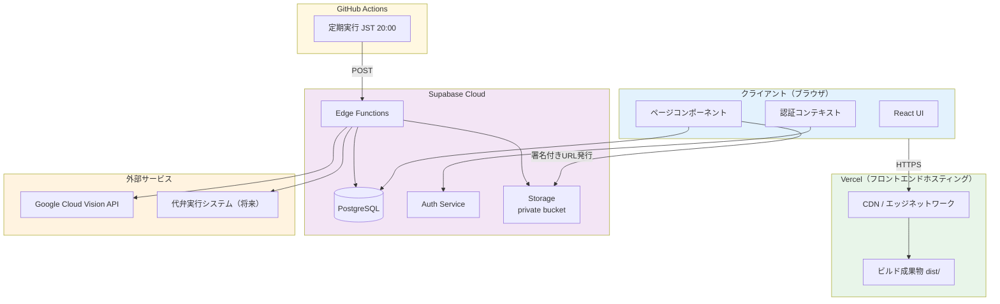

# アーキテクチャ設計ドキュメント

## 技術スタック

- **フロントエンド**: React 18.3 + TypeScript 5.5 + Tailwind CSS 3.4 + Vite 5.4
- **バックエンド**: Supabase (PostgreSQL + Auth + Storage + Edge Functions)
- **データベース**: PostgreSQL (Supabase管理)
- **認証**: Supabase Auth (Email/Password)
- **フロントエンドホスティング**: Vercel（CDN・自動デプロイ）
- **バッチ実行基盤**: Supabase Cloud + GitHub Actions
- **AI OCR**: Google Cloud Vision API（DOCUMENT_TEXT_DETECTION・無料枠 1,000 ユニット/月）
- **UI アイコン**: Lucide React

## システム構成図



## 選択理由

### React + TypeScript
- **理由**: 型安全性、開発効率、エコシステムの充実
- **メリット**: 大規模プロジェクトへの拡張性、保守性の高さ

### Tailwind CSS
- **理由**: 高速な UI 開発、デザインの一貫性
- **メリット**: カスタマイズ性が高く、プロダクションバンドルサイズが小さい

### Supabase
- **理由**: PostgreSQL + 認証 + ストレージ + Edge Functions をオールインワンで提供
- **メリット**:
  - インフラ管理不要（フルマネージド）
  - Row Level Security (RLS) による高度なセキュリティ
  - リアルタイム機能（将来的な拡張に対応）
  - 低コスト（個人開発に最適）

### Vercel
- **理由**: Vite ビルドをゼロ設定でデプロイ可能。グローバル CDN を標準提供
- **メリット**:
  - GitHub リポジトリと連携し、`main` ブランチへの push で自動デプロイ
  - エッジネットワーク（全世界 100+ PoP）による高速配信
  - 環境変数の GUI 管理（`VITE_SUPABASE_URL` 等）
  - プレビューデプロイ（PR ごとに固有 URL を発行）
  - Free Tier で個人開発に十分な帯域

### Vite
- **理由**: 高速なビルド、HMR（ホットモジュールリプレースメント）
- **メリット**: 開発体験の向上、本番ビルドの最適化

## データフロー

### 1. 認証フロー
```
ユーザー入力 → LoginForm → AuthContext → Supabase Auth
                                              ↓
                                         Session管理
                                              ↓
                                      RLS ポリシー適用
```

### 2. 書類アップロードフロー
```
画像選択 → UploadDocument → Supabase Storage（privateバケット）
                                   ↓
                     オブジェクトキー（パス）のみ取得
                                   ↓
                         documents テーブル登録
                                   ↓
                       document_data テーブル登録
                                   ↓
                      document_history 記録
```

### 3. OCR 処理フロー
```
アップロード完了 → UploadDocument → OCR Edge Function（ocr-extract）
                                          ↓
                              Storage 署名付きURL 発行（60秒）
                                          ↓
                              Google Cloud Vision API 呼び出し
                                          ↓
                              氏名・生年月日・住所をパース
                                          ↓
                    ┌─────────────────────────────────────┐
                    │ 成功                    │ 失敗（429/エラー）  │
                    ↓                         ↓
             document_data 更新       status を 'uploaded' に戻す
             status → ocr_completed   ocr_error_message を記録
                                      Toast でエラー表示（手動入力へ）
```

### 4. 書類確認フロー
```
書類一覧 → DocumentList → createSignedUrl（有効期限1時間）
                               ↓
                        DocumentDetail
                               ↓
                      画像 + OCR データ表示
                               ↓
                     編集・保存・確認OK/差戻し
                               ↓
                       documents ステータス更新
                               ↓
                      document_history 記録
```

## データベース設計

### 主要テーブル

#### documents
書類のメタデータを管理
- `id`: UUID（主キー）
- `user_id`: UUID（auth.users参照）
- `document_type`: テキスト（書類種別）
- `image_url`: テキスト（Storage オブジェクトキー。公開URLではない）
- `status`: テキスト（処理状態）
- `created_at`, `updated_at`: タイムスタンプ

#### document_data
OCR抽出データを管理
- `id`: UUID（主キー）
- `document_id`: UUID（documents参照）
- `name`: テキスト（氏名）
- `birth_date`: 日付（生年月日）
- `address`: テキスト（住所）
- `ocr_executed_at`: タイムスタンプ（OCR実行日時）
- `created_at`, `updated_at`: タイムスタンプ

#### document_history
操作履歴を記録
- `id`: UUID（主キー）
- `document_id`: UUID（documents参照）
- `operator_id`: UUID（auth.users参照）
- `action`: テキスト（操作種別）
- `changes`: JSONB（変更内容）
- `created_at`: タイムスタンプ

### リレーション
- `documents.user_id` → `auth.users.id` (多対一)
- `document_data.document_id` → `documents.id` (一対一)
- `document_history.document_id` → `documents.id` (多対一)
- `document_history.operator_id` → `auth.users.id` (多対一)
- `batch_export_items.batch_export_id` → `batch_exports.id` (多対一)
- `batch_export_items.document_id` → `documents.id` (多対一)

## セキュリティ設計

### Row Level Security (RLS)

すべてのテーブルで RLS を有効化し、ユーザーは自分のデータのみアクセス可能。

#### documents テーブル
```sql
-- SELECT: ユーザーは自分の書類のみ閲覧可能
CREATE POLICY "Users can view their own documents"
  ON documents FOR SELECT
  TO authenticated
  USING (auth.uid() = user_id);

-- INSERT: ユーザーは自分の書類のみ作成可能
CREATE POLICY "Users can insert their own documents"
  ON documents FOR INSERT
  TO authenticated
  WITH CHECK (auth.uid() = user_id);
```

#### Storage（プライベートバケット）
```sql
-- ユーザーは自分のフォルダ (user_id) のみアクセス可能
-- バケットは public: false（署名付きURLでのみ閲覧可能）
CREATE POLICY "Users can upload their own documents"
  ON storage.objects FOR INSERT
  TO authenticated
  WITH CHECK (
    bucket_id = 'documents' AND
    (storage.foldername(name))[1] = auth.uid()::text
  );
```

### 認証
- Email/Password 方式
- Supabase Auth による JWT トークン管理
- セッション管理の自動化

## 初期コスト（月額）

### Vercel Free Tier
- **帯域**: 100GB/月
- **ビルド**: 6,000 分/月
- **合計**: $0/月

### Supabase Free Tier
- **データベース**: 500MB まで無料
- **ストレージ**: 1GB まで無料
- **認証**: 無制限ユーザー
- **Edge Functions**: 500,000 リクエスト/月まで無料
- **合計**: $0/月

### 想定スケールアップ時（Pro プラン）
- **Vercel Pro**: $20/月（チーム利用時）
- **Supabase Pro**: $25/月
- **合計**: $45/月

## パフォーマンス最適化

### 実装済み
- Tailwind CSS の本番ビルド最適化（PurgeCSS）
- Vite による高速ビルド（バンドルサイズ 305 KB / gzip 89 KB）
- インデックス作成（user_id, status, document_id）
- Vercel グローバル CDN による静的アセット配信
- 画像の遅延読み込み

### 将来的な最適化
- 画像の自動圧縮・リサイズ
- キャッシング戦略の精緻化
- リアルタイム同期の最適化

## 拡張性

### 短期的な拡張
1. ~~OCR API 統合（Edge Functions 経由）~~ → **Phase 6 で実装済み**
2. 画像プレビュー機能の強化

### 長期的な拡張
1. 権限管理システム（ロールベースアクセス制御）
2. マルチテナント対応
3. 監査ログの強化
4. レポート機能
5. 通知システム

## 運用・保守

### 監視
- Vercel Dashboard（デプロイ状況・関数ログ）
- Supabase Dashboard（DB・Storage・Edge Function ログ）
- GitHub Actions（バッチ実行履歴）

### バックアップ
- Supabase による自動バックアップ（日次）
- Point-in-Time Recovery（PITR）対応

### デプロイ手順

#### フロントエンド（Vercel）
1. GitHub リポジトリを Vercel プロジェクトに連携
2. Vercel ダッシュボード → Settings → Environment Variables に以下を登録:

| 変数名 | 値 |
|---|---|
| `VITE_SUPABASE_URL` | `https://ckdofopojlxqdnerxmdk.supabase.co` |
| `VITE_SUPABASE_ANON_KEY` | Supabase ダッシュボードの anon キー |

3. Build Command: `npm run build`、Output Directory: `dist` を確認（Vite 検出で自動設定される）
4. `main` ブランチへ push → Vercel が自動ビルド・デプロイ

#### バックエンド（Supabase）
```bash
npx supabase link --project-ref ckdofopojlxqdnerxmdk
npx supabase db push
npx supabase functions deploy batch-export
```

#### バッチ自動実行（GitHub Actions）
GitHub リポジトリ → Settings → Secrets and variables → Actions に以下を登録:

| シークレット名 | 値 |
|---|---|
| `SUPABASE_URL` | `https://ckdofopojlxqdnerxmdk.supabase.co` |
| `SUPABASE_SERVICE_ROLE_KEY` | Supabase ダッシュボードの service_role キー |

## まとめ

このアーキテクチャは、個人開発に最適化されており、以下の特徴があります：

- **低コスト**: 初期費用 $0（Vercel Free + Supabase Free）、スケールアップ時も $45/月程度
- **高速開発**: React + TypeScript + Tailwind CSS + Supabase のモダンスタック
- **ゼロ運用**: Vercel 自動デプロイ + Supabase フルマネージド + GitHub Actions バッチ
- **セキュア**: RLS + プライベートバケット + 署名付きURL による多層防御
- **拡張性**: 将来的な機能追加に柔軟に対応
- **保守性**: TypeScript による型安全性、明確なコンポーネント分割
