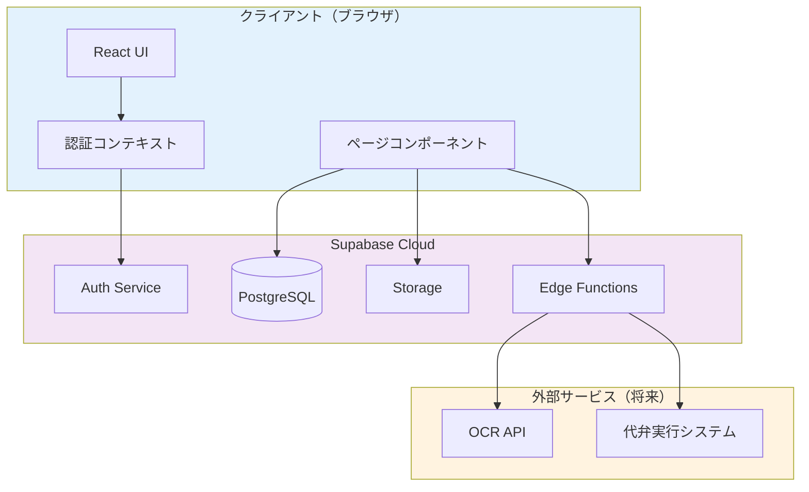

# アーキテクチャ設計ドキュメント

## 技術スタック

- **フロントエンド**: React 18.3 + TypeScript 5.5 + Tailwind CSS 3.4 + Vite 5.4
- **バックエンド**: Supabase (PostgreSQL + Auth + Storage + Edge Functions)
- **データベース**: PostgreSQL (Supabase管理)
- **認証**: Supabase Auth (Email/Password)
- **インフラ**: Supabase Cloud
- **UI アイコン**: Lucide React

## システム構成図



## 選択理由

### React + TypeScript
- **理由**: 型安全性、開発効率、エコシステムの充実
- **メリット**: 大規模プロジェクトへの拡張性、保守性の高さ

### Tailwind CSS
- **理由**: 高速な UI 開発、デザインの一貫性
- **メリット**: カスタマイズ性が高く、プロダクションバンドルサイズが小さい

### Supabase
- **理由**: PostgreSQL + 認証 + ストレージ + Edge Functions をオールインワンで提供
- **メリット**:
  - インフラ管理不要（フルマネージド）
  - Row Level Security (RLS) による高度なセキュリティ
  - リアルタイム機能（将来的な拡張に対応）
  - 低コスト（個人開発に最適）

### Vite
- **理由**: 高速なビルド、HMR（ホットモジュールリプレースメント）
- **メリット**: 開発体験の向上、本番ビルドの最適化

## データフロー

### 1. 認証フロー
```
ユーザー入力 → LoginForm → AuthContext → Supabase Auth
                                              ↓
                                         Session管理
                                              ↓
                                      RLS ポリシー適用
```

### 2. 書類アップロードフロー
```
画像選択 → UploadDocument → Supabase Storage
                                   ↓
                           画像URL取得
                                   ↓
                         documents テーブル登録
                                   ↓
                       document_data テーブル登録
                                   ↓
                      document_history 記録
```

### 3. 書類確認フロー
```
書類一覧 → DocumentList → DocumentDetail
                               ↓
                      画像 + OCR データ表示
                               ↓
                     編集・保存・確認OK/差戻し
                               ↓
                       documents ステータス更新
                               ↓
                      document_history 記録
```

## データベース設計

### 主要テーブル

#### documents
書類のメタデータを管理
- `id`: UUID（主キー）
- `user_id`: UUID（auth.users参照）
- `document_type`: テキスト（書類種別）
- `image_url`: テキスト（画像URL）
- `status`: テキスト（処理状態）
- `created_at`, `updated_at`: タイムスタンプ

#### document_data
OCR抽出データを管理
- `id`: UUID（主キー）
- `document_id`: UUID（documents参照）
- `name`: テキスト（氏名）
- `birth_date`: 日付（生年月日）
- `address`: テキスト（住所）
- `ocr_executed_at`: タイムスタンプ（OCR実行日時）
- `created_at`, `updated_at`: タイムスタンプ

#### document_history
操作履歴を記録
- `id`: UUID（主キー）
- `document_id`: UUID（documents参照）
- `operator_id`: UUID（auth.users参照）
- `action`: テキスト（操作種別）
- `changes`: JSONB（変更内容）
- `created_at`: タイムスタンプ

### リレーション
- `documents.user_id` → `auth.users.id` (多対一)
- `document_data.document_id` → `documents.id` (一対一)
- `document_history.document_id` → `documents.id` (多対一)
- `document_history.operator_id` → `auth.users.id` (多対一)
- `batch_export_items.batch_export_id` → `batch_exports.id` (多対一)
- `batch_export_items.document_id` → `documents.id` (多対一)

## セキュリティ設計

### Row Level Security (RLS)

すべてのテーブルで RLS を有効化し、ユーザーは自分のデータのみアクセス可能。

#### documents テーブル
```sql
-- SELECT: ユーザーは自分の書類のみ閲覧可能
CREATE POLICY "Users can view their own documents"
  ON documents FOR SELECT
  TO authenticated
  USING (auth.uid() = user_id);

-- INSERT: ユーザーは自分の書類のみ作成可能
CREATE POLICY "Users can insert their own documents"
  ON documents FOR INSERT
  TO authenticated
  WITH CHECK (auth.uid() = user_id);
```

#### Storage
```sql
-- ユーザーは自分のフォルダ (user_id) のみアクセス可能
CREATE POLICY "Users can upload their own documents"
  ON storage.objects FOR INSERT
  TO authenticated
  WITH CHECK (
    bucket_id = 'documents' AND
    (storage.foldername(name))[1] = auth.uid()::text
  );
```

### 認証
- Email/Password 方式
- Supabase Auth による JWT トークン管理
- セッション管理の自動化

## 初期コスト（月額）

### Supabase Free Tier
- **データベース**: 500MB まで無料
- **ストレージ**: 1GB まで無料
- **認証**: 無制限ユーザー
- **Edge Functions**: 500,000 リクエスト/月まで無料
- **合計**: $0/月

### 想定スケールアップ時（Pro プラン）
- **Supabase Pro**: $25/月
  - データベース: 8GB
  - ストレージ: 100GB
  - 無制限 API リクエスト
- **合計**: $25/月

## パフォーマンス最適化

### 実装済み
- Tailwind CSS の本番ビルド最適化（PurgeCSS）
- Vite による高速ビルド
- インデックス作成（user_id, status, document_id）
- 画像の遅延読み込み

### 将来的な最適化
- 画像の自動圧縮・リサイズ
- CDN 配信
- キャッシング戦略
- リアルタイム同期の最適化

## 拡張性

### 短期的な拡張
1. OCR API 統合（Edge Functions 経由）
2. バッチ連携機能（Edge Functions + Cron）
3. 画像プレビュー機能の強化

### 長期的な拡張
1. 権限管理システム（ロールベースアクセス制御）
2. マルチテナント対応
3. 監査ログの強化
4. レポート機能
5. 通知システム

## 運用・保守

### 監視
- Supabase Dashboard での監視
- エラーログの確認
- パフォーマンスメトリクスの追跡

### バックアップ
- Supabase による自動バックアップ（日次）
- Point-in-Time Recovery（PITR）対応

### デプロイ
- Git による自動デプロイ（Vercel, Netlify 等）
- CI/CD パイプライン設定

## まとめ

このアーキテクチャは、個人開発に最適化されており、以下の特徴があります：

- **低コスト**: 初期費用 $0、スケールアップ時も $25/月程度
- **高速開発**: React + TypeScript + Tailwind CSS + Supabase のモダンスタック
- **セキュア**: RLS による細かいアクセス制御
- **拡張性**: 将来的な機能追加に柔軟に対応
- **保守性**: TypeScript による型安全性、明確なコンポーネント分割
