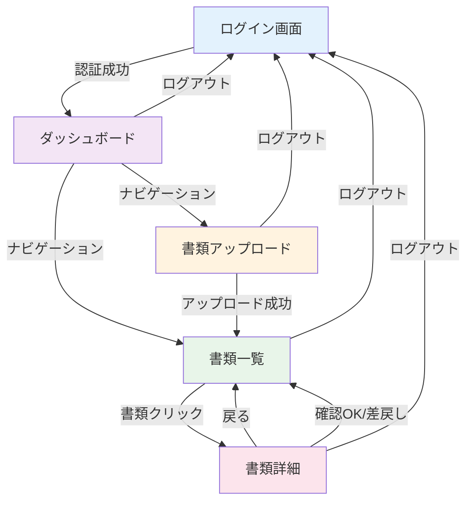

# サイトマップ（画面一覧と遷移）

## ページ一覧

### 認証前ページ
- `/`: ログイン・サインアップ画面

### 認証後ページ（オペレーター向け）
- `/dashboard`: ダッシュボード（書類処理状況の統計）
- `/upload`: 書類アップロード画面
- `/documents`: 書類一覧画面
- `/documents/:id`: 書類詳細・確認画面

### 将来の管理者向けページ
- `/admin`: 管理者ダッシュボード
- `/admin/users`: ユーザー管理
- `/admin/batch`: バッチエクスポート管理
- `/admin/audit`: 監査ログ閲覧

---

## 画面遷移図

---

## 主要画面の目的と要素

### `/` - ログイン・サインアップ画面

**目的**: ユーザー認証とアカウント作成

**要素**:
- ロゴとアプリタイトル
- メールアドレス入力フィールド
- パスワード入力フィールド（6文字以上）
- ログイン/サインアップ切り替えボタン
- 送信ボタン
- エラーメッセージ表示エリア

**デザイン**:
- グラデーション背景（slate-50 to slate-100）
- 白いカード型のフォーム
- 青色（blue-600）のアクセントカラー
- クリーンでモダンなデザイン

---

### `/dashboard` - ダッシュボード

**目的**: 書類処理状況を一目で把握

**要素**:
- ページタイトルと説明
- 統計カード（4つ）:
  - 総書類数
  - 確認待ち（uploaded, ocr_processing, ocr_completed）
  - 確認済み（confirmed）
  - 差戻し（rejected）
- 処理済み率のプログレスバー
- 各統計へのアニメーション付きアイコン

**デザイン**:
- カードレイアウト（グリッド表示）
- アイコンと数値の組み合わせ
- カラーコーディング:
  - 青色: 総書類数
  - オレンジ色: 確認待ち
  - 緑色: 確認済み
  - 赤色: 差戻し
- ホバーエフェクト

---

### `/upload` - 書類アップロード画面

**目的**: 本人確認書類を簡単にアップロード

**要素**:
- ページタイトルと説明
- 書類種別選択（2つのカード）:
  - マイナンバーカード
  - 運転免許証
- ファイル選択エリア（ドラッグ&ドロップ対応）
- 画像プレビュー
- アップロードボタン
- 成功/エラーメッセージ

**デザイン**:
- 中央寄せレイアウト
- 破線のドロップゾーン
- 選択中の書類種別をハイライト（blue-50背景）
- プレビュー画像の表示

**制約**:
- 対応形式: PNG, JPG, JPEG
- 最大ファイルサイズ: 5MB

---

### `/documents` - 書類一覧画面

**目的**: アップロードした書類の一覧と状態確認

**要素**:
- ページタイトルと説明
- フィルターボタン（4つ）:
  - すべて
  - 確認待ち
  - 確認済み
  - 差戻し
- 書類カード（グリッド表示）:
  - サムネイル画像
  - 書類種別
  - ステータスバッジ
  - アップロード日時
  - 「詳細を見る」ボタン
- 空状態の表示（書類がない場合）

**デザイン**:
- レスポンシブグリッド（1列〜3列）
- カードホバーエフェクト（画像拡大）
- ステータスバッジの色分け:
  - オレンジ色: 確認待ち
  - 緑色: 確認済み
  - 赤色: 差戻し

---

### `/documents/:id` - 書類詳細・確認画面

**目的**: 書類画像を確認しながらOCR抽出データを編集・承認

**要素**:
- 戻るボタン
- ページタイトル（書類種別表示）
- 左側パネル:
  - 書類画像表示
  - 画像回転ボタン
  - 画像拡大ボタン
  - 操作履歴の展開ボタン
  - 操作履歴一覧（展開時）
- 右側パネル:
  - 氏名入力フィールド
  - 生年月日入力フィールド（日付ピッカー）
  - 住所入力フィールド（テキストエリア）
  - 保存ボタン
  - 確認OKボタン（緑色）
  - 差戻しボタン（赤色）
  - 確認済み/差戻し済みの場合は通知バナー

**デザイン**:
- 2カラムレイアウト（レスポンシブ）
- 画像はアスペクト比を保って表示
- 入力フィールドは focus 時に青色の枠
- ボタンはアイコン付き
- 履歴は時系列で表示

**動作**:
- 確認済み・差戻し済みの場合は編集不可
- 保存ボタンで変更を保存（履歴記録）
- 確認OKでステータスを「confirmed」に更新
- 差戻しでステータスを「rejected」に更新
- すべての操作で履歴が記録される

---

## URL設計ルール

### 基本ルール
- **一覧**: `/documents` - 複数形を使用
- **詳細**: `/documents/:id` - パラメータで識別
- **作成**: `/upload` - 動詞を使用
- **ダッシュボード**: `/dashboard` - 名詞を使用

### 理由
- RESTful な命名規則に従う
- URL から画面の目的が明確
- 階層構造が理解しやすい

---

## ナビゲーション

### グローバルナビゲーション
すべての認証後ページで表示されるヘッダーナビゲーション:
- ダッシュボード
- 書類アップロード
- 書類一覧
- ログアウト
- ユーザーメールアドレス表示

### モバイル対応
- ハンバーガーメニュー（768px以下）
- タップしやすいボタンサイズ
- スワイプジェスチャー対応（将来）

---

## 指針

### 1. Home → 一覧 → 詳細 → 行動 の3画面で成立
MVPとして以下の流れを実現:
1. **ダッシュボード**: 全体の状況を把握
2. **書類一覧**: 書類を選択
3. **書類詳細**: 確認・承認

### 2. 操作は直感的に
- ボタンの役割が明確（アイコン+テキスト）
- 状態変化がわかりやすい（ローディング、成功、エラー）
- 取り消しが必要な操作は確認ダイアログ（将来実装）

### 3. レスポンシブデザイン
- モバイルファーストで設計
- タブレット・デスクトップで快適に操作可能
- ブレークポイント: 640px, 768px, 1024px, 1280px

### 4. パフォーマンス
- 画像は遅延読み込み
- 必要なデータのみ取得（select で指定）
- キャッシングの活用（Supabase クライアント）

---

## 運用観点

### 設定の集約
将来的に以下を `src/config.ts` に集約:
- 問い合わせURL
- 外部リンク
- 表示名・ラベル
- デフォルト値

### エラーハンドリング
- ネットワークエラー時の再試行
- ユーザーフレンドリーなエラーメッセージ
- エラーログの記録（将来）

### 監査対応
- すべての操作を `document_history` に記録
- 操作者、操作日時、変更内容を保存
- 管理者による閲覧機能（将来）

---

## 将来の拡張

### 権限管理
- オペレーター: 書類の確認・編集
- 管理者: すべての書類の閲覧、ユーザー管理、バッチ実行
- 監査閲覧専用: 読み取りのみ

### バッチ連携機能
- `/admin/batch` ページで手動実行
- 自動実行のスケジュール設定
- 連携結果の可視化

### 通知機能
- 新規書類アップロード通知
- 確認期限の通知
- バッチ連携結果の通知
